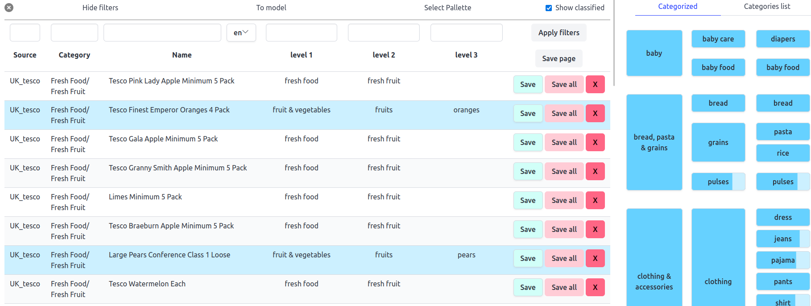

The goal of this oroject is to classify supermarket products around the world using their name.
Later, to improve performance, the information considering a product's brand, along with its volume/weight migth be added to the model's input.

An important feature of this project is data cleaner - a web app that helps to filter, label and clean the data.
